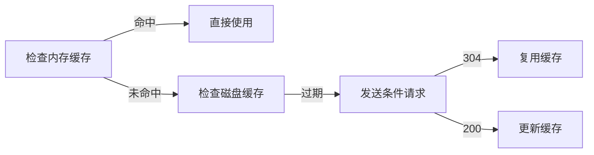

# 浏览器缓存机制

浏览器缓存机制是提升网页性能的核心技术，通过本地存储资源减少网络请求。以下是其核心要点：

## 1. 缓存类型与存储位置

### 1.1 内存缓存（Memory Cache）
- 存储临时资源（如 CSS/JS），读取速度最快。
- 生命周期随浏览器标签页关闭而结束。

### 1.2 磁盘缓存（Disk Cache）
- 持久化存储大文件（如图片/视频）。
- 根据 HTTP 头策略决定缓存周期，容量可达数百 MB。

### 1.3 Service Worker 缓存
- 可编程控制的持久化缓存。
- 支持离线访问，需 HTTPS 协议。

### 1.4 Push Cache（HTTP/2 专属）
- 会话级临时缓存，有效期约 5 分钟。
- 优先级最低，适合预加载资源。

## 2. 缓存控制策略

### 2.1 强缓存（无服务器交互）
- 通过 `Cache-Control`（优先级高）和 `Expires` 头控制。
- 常见指令：
  - `Cache-Control: max-age=31536000, public` // 缓存 1 年。
  - `Cache-Control: no-store` // 禁止缓存。

### 2.2 协商缓存（需服务器验证）
- 校验机制：
  - `Last-Modified` + `If-Modified-Since`（时间戳比对）。
  - `ETag` + `If-None-Match`（内容哈希值比对）。
- 返回 304 状态码复用缓存。

## 3. 缓存工作流程

### 3.1 首次请求
首次请求时，服务器返回资源及缓存头（如 `Cache-Control` 和 `ETag`）。

### 3.2 再次请求

## 4. 特殊机制

### 4.1 启发式缓存
当未显式设置 `Cache-Control` 时，浏览器按公式计算缓存时间：  
$$缓存时间 = (Date - Last-Modified) \times 0.1$$  
例如资源最后修改于 30 天前，则默认缓存 3 天。

### 4.2 用户行为影响

| 操作方式               | 缓存处理               |
|------------------------|------------------------|
| 地址栏回车             | 遵守缓存头             |
| Ctrl+F5 强制刷新       | 跳过所有缓存           |
| 清除缓存并硬性重新加载 | 先删除缓存再请求新资源 |

## 5. 最佳实践

1. 静态资源设置长期缓存（如 `max-age=31536000`）。
2. 使用内容哈希命名文件（如 `app.3a87b12.js`）。
3. 动态资源采用 `no-cache` + `ETag` 验证。

通过合理配置，缓存可使页面加载速度提升 50% 以上。开发者可通过 Chrome DevTools 的 Network 面板查看具体资源的缓存状态和策略。
<GiscusComment />